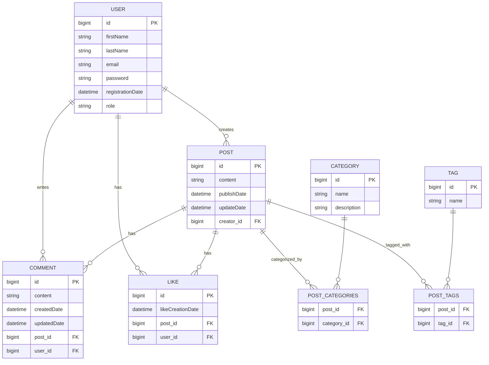

# Spring Boot Blog API

A RESTful Blog API built with Spring Boot featuring JWT authentication, CRUD operations for posts, comments, categries, tags, likes, and user management.

## 🚀 Features

- JWT Authentication & Authorization
- CRUD operations for Posts, Comments, Categories
- User registration and management

## 🛠️ Tech Stack

- **Spring Boot 3.x** - Framework
- **Spring Security** - Authentication
- **Spring Data JPA** - Data persistence
- **MySQL** - Database
- **JWT** - Token-based auth

## 📊 Database Schema



## 📋 Prerequisites

- Java 17+
- Maven 3.6+
- MySQL 8.0+

## 🚀 Quick Start

### 1. Clone & Setup
```bash
git clone https://github.com/hagagg/springboot-blog-api.git
cd springboot-blog-api
```

### 2. Configuration
Update `application.properties` with your database connection properties:
```properties
# Database Configuration
spring.datasource.url=jdbc:mysql://localhost:3306/your_database_name
spring.datasource.username=your_username
spring.datasource.password=your_password
spring.datasource.driver-class-name=com.mysql.cj.jdbc.Driver

# JPA Configuration
spring.jpa.hibernate.ddl-auto=update
spring.jpa.show-sql=true
```
```bash
# Build the project
mvn clean install

# Run the application
mvn spring-boot:run
```

<hr style="border: 2px solid #000;">
## 👨‍💻 Author

**Ahmed Hagag** - [@hagagg](https://github.com/hagagg)
